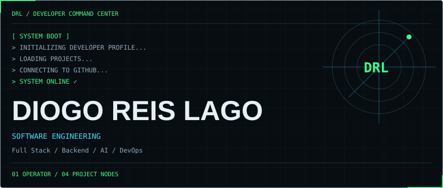
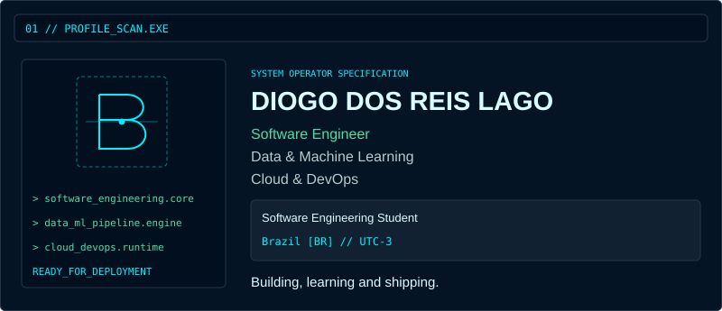
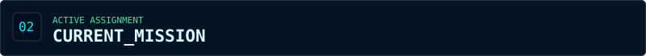
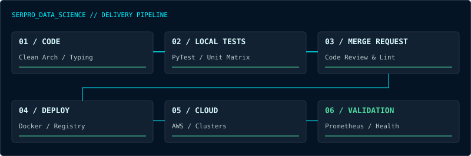
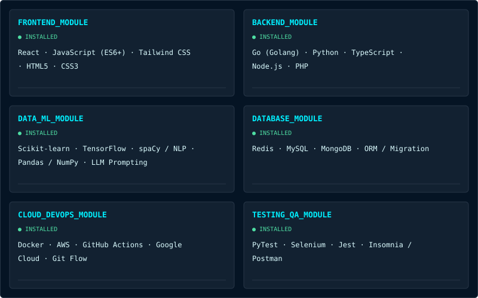
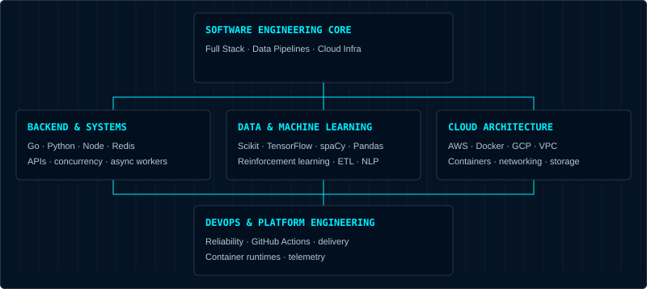
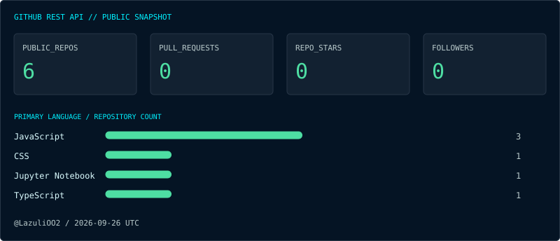
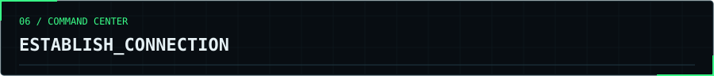
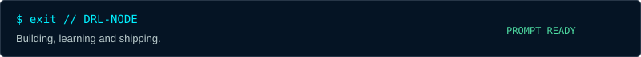

<!-- Generated by scripts/build.py. Edit assets/profile-data.json for projects, modules and study areas. -->

<picture>
  <source media="(max-width: 600px)" srcset="assets/header-mobile.svg">
  
</picture>

<a href="#profile">PROFILE</a> · <a href="#mission">MISSION</a> · <a href="#stack">STACK</a> · <a href="#projects">PROJECTS</a> · <a href="#graph">MAP</a> · <a href="#metrics">METRICS</a> · <a href="#exploring">EXPLORING</a> · <a href="#contact">CONTACT</a>

<picture>
  <source media="(max-width: 600px)" srcset="assets/profile-terminal-mobile.svg">
  
</picture>

<code>AVAILABLE_FOR_WORK</code> · <code>BUILDING_AT_SCALE</code> · <code>CONTINUOUS_LEARNING</code> Full Stack · Data Pipelines · Cloud Infra

<a href="#contact">[ ESTABLISH_CONNECTION ]</a> &nbsp; <a href="#projects">[ VIEW_REPOSITORIES ]</a>

<picture>
  <source media="(max-width: 600px)" srcset="assets/mission-label-mobile.svg">
  
</picture>

**Data Science Intern · SERPRO**  
Serpro — Serviço Federal de Processamento de Dados  
`Cloud` · `ML` · `Infrastructure`

Enterprise scale data processing & model deployment. CI/CD Continuous Delivery — automated testing, container runtime & telemetry.

<picture>
  <source media="(max-width: 600px)" srcset="assets/mission-pipeline-mobile.svg">
  
</picture>

<picture>
  <source media="(max-width: 600px)" srcset="assets/stack-label-mobile.svg">
  
</picture>

<picture>
  <source media="(max-width: 600px)" srcset="assets/tech-stack-mobile.svg">
  
</picture>

Inspect installed modules / technologies & responsibilities

<table>
<tr><td>

<strong><samp>FRONTEND_MODULE</samp></strong> &nbsp; <samp>[INSTALLED]</samp>

Client interfaces, state machines and responsive rendering.

<code>React</code> · <code>JavaScript (ES6+)</code> · <code>Tailwind CSS</code> · <code>HTML5</code> · <code>CSS3</code>

</td></tr>
<tr><td>

<strong><samp>BACKEND_MODULE</samp></strong> &nbsp; <samp>[INSTALLED]</samp>

High-throughput servers, microservices, concurrent APIs and typed workflows.

<code>Go (Golang)</code> · <code>Python</code> · <code>TypeScript</code> · <code>Node.js</code> · <code>PHP</code>

</td></tr>
<tr><td>

<strong><samp>DATA_ML_MODULE</samp></strong> &nbsp; <samp>[INSTALLED]</samp>

Reinforcement learning, predictive intelligence, transformers and NLP parsing.

<code>Scikit-learn</code> · <code>TensorFlow</code> · <code>spaCy / NLP</code> · <code>Pandas / NumPy</code> · <code>LLM Prompting</code>

</td></tr>
<tr><td>

<strong><samp>DATABASE_MODULE</samp></strong> &nbsp; <samp>[INSTALLED]</samp>

Relational persistence, document storage, and ultra-fast distributed caching.

<code>Redis</code> · <code>MySQL</code> · <code>MongoDB</code> · <code>ORM / Migration</code>

</td></tr>
<tr><td>

<strong><samp>CLOUD_DEVOPS_MODULE</samp></strong> &nbsp; <samp>[INSTALLED]</samp>

Immutable infra, automated GitHub action runners, and multi-cloud nodes.

<code>Docker</code> · <code>AWS</code> · <code>GitHub Actions</code> · <code>Google Cloud</code> · <code>Git Flow</code>

</td></tr>
<tr><td>

<strong><samp>TESTING_QA_MODULE</samp></strong> &nbsp; <samp>[INSTALLED]</samp>

End-to-end integration, headless browsers, unit assertions and API load benchmarks.

<code>PyTest</code> · <code>Selenium</code> · <code>Jest</code> · <code>Insomnia / Postman</code>

</td></tr>
</table>

<picture>
  <source media="(max-width: 600px)" srcset="assets/projects-label-mobile.svg">
  
</picture>

<table>
<tr><td>

<samp>┌─ REPOSITORY_NODE_01 ── FINANCIAL_ML</samp>

<samp>REINFORCEMENT_LEARNING</samp>

<strong>Algoritmo de Aprendizado por Reforço para Ativos</strong>

Agent de reinforcement learning projetado para tomada de decisões financeiras em séries temporais de ativos de mercado. Utiliza funções de recompensa acumulada ajustadas pela volatilidade e otimização de política para mitigar risco e maximizar o retorno da carteira.

<code>Python</code> · <code>Q-Learning / Deep RL</code> · <code>NumPy / Pandas</code> · <code>Matplotlib</code>

<code>REPOSITORY_URL_REQUIRED</code>

</td></tr>
</table>

<table>
<tr><td>

<samp>┌─ REPOSITORY_NODE_02 ── PIPELINE_ETL</samp>

<samp>DATA_ENGINEERING</samp>

<strong>Pipeline ETL com Processamento &amp; Dashboard Interativo</strong>

Arquitetura de extração, transformação e carga (ETL) com processamento de texto automatizado via spaCy, validação de integridade em banco relacional e renderização de métricas em tempo real com interface Streamlit.

<code>Python</code> · <code>spaCy</code> · <code>Streamlit</code> · <code>SQL Database</code> · <code>Data Cleaning</code>

<code>REPOSITORY_URL_REQUIRED</code>

</td></tr>
</table>

<table>
<tr><td>

<samp>┌─ REPOSITORY_NODE_03 ── LLM_EXTRACTION</samp>

<samp>GEN_AI</samp>

<strong>Extrator de Pedidos com LLM &amp; Dados Estruturados</strong>

Engine de inteligência que analisa mensagens de texto livres e desestruturadas e converte instantaneamente em schemas JSON válidos e tipados com validação Pydantic, roteando pedidos para sistemas de retaguarda sem fricção humana.

<code>LLM / OpenAI</code> · <code>NLP</code> · <code>JSON Schema</code> · <code>Python / FastAPI</code>

<code>REPOSITORY_URL_REQUIRED</code>

</td></tr>
</table>

<table>
<tr><td>

<samp>┌─ REPOSITORY_NODE_04 ── REST_API</samp>

<samp>HIGH_PERFORMANCE_GO</samp>

<strong>Lenovo Scraper API • Concurrent Go Engine</strong>

Microsserviço de alta concorrência escrito em Golang para scraping e monitoramento de produtos em tempo real. Implementa supressão de requisições redundantes com Singleflight, cache distribuído com expiração inteligente, retry com backoff exponencial e graceful shutdown com TLS benchmarks.

<code>REST API</code> · <code>CACHE</code> · <code>RETRY</code> · <code>SINGLEFLIGHT</code> · <code>TLS</code> · <code>HEALTH CHECK</code>

<code>REPOSITORY_URL_REQUIRED</code>

</td></tr>
</table>

<table>
<tr><td>

<samp>┌─ REPOSITORY_NODE_05 ── SECURITY &amp; DDD</samp>

<samp>FULL_STACK_ARCHITECTURE</samp>

<strong>LittleBNB • Production-Grade Booking System</strong>

Sistema completo de locação e reservas construído com princípios de Domain-Driven Design (DDD). Engenharia de segurança focada em cookies HTTP-only, autenticação com tokens rotativos, mitigação de abusos por rate limiting dinâmico e validação sob carga pesada.

<code>Full Stack</code> · <code>HTTP-Only Auth</code> · <code>Rate Limiter</code> · <code>DDD Model</code> · <code>Load Testing</code>

<code>REPOSITORY_URL_REQUIRED</code>

</td></tr>
</table>

<picture>
  <source media="(max-width: 600px)" srcset="assets/graph-label-mobile.svg">
  
</picture>

<picture>
  <source media="(max-width: 600px)" srcset="assets/engineering-map-mobile.svg">
  
</picture>

Inspect topology / architecture notes

**Backend & Systems:** High throughput APIs, Golang concurrency, async workers & microservices. Go · Python · Node · Redis.

**Data & Machine Learning:** Reinforcement learning, ETL pipelines, NLP parsers & predictive analytics. Scikit · TensorFlow · spaCy · Pandas.

**Cloud Architecture:** Containers, auto-scaling environments, secure networking & storage. AWS · Docker · GCP · VPC.

**DevOps & Reliability Engineering:** Continuous delivery (GitHub Actions), containerized runtimes, telemetry metrics, and high uptime operations.

<picture>
  <source media="(max-width: 600px)" srcset="assets/metrics-label-mobile.svg">
  
</picture>

<picture>
  <source media="(max-width: 600px)" srcset="assets/github-telemetry-mobile.svg">
  
</picture>

Inspect telemetry / source & scope

Snapshot: **2026-09-26T22:42:38Z** · [@LazuliOO2](https://github.com/LazuliOO2) · [Source data](assets/telemetry.json).

Public repositories include forks. Pull requests count public PRs authored by this account, across all states; they do not imply approval or merge. Stars are summed across owned public repositories. Languages count the primary language of each non-fork public repository with a detected language; they do not measure proficiency or lines of code.

Commits, contributions and streak are omitted because this snapshot does not provide reliable totals.

<picture>
  <source media="(max-width: 600px)" srcset="assets/exploring-label-mobile.svg">
  
</picture>

<table>
<tr><td>
<samp>software_architecture.exe</samp> <samp>[RUNNING]</samp>

Advanced clean architecture patterns, hexagonal domain design and resilient event brokers.
</td></tr>
<tr><td>
<samp>machine_learning.exe</samp> <samp>[RUNNING]</samp>

Deep reinforcement learning policies, reward shaping functions and high-velocity inference pipelines.
</td></tr>
<tr><td>
<samp>cloud_infrastructure.exe</samp> <samp>[RUNNING]</samp>

AWS serverless architectures, multi-region container orchestration and declarative IaC setups.
</td></tr>
<tr><td>
<samp>distributed_systems.exe</samp> <samp>[INITIALIZING]</samp>

Consensus algorithms (Raft), distributed key-value storage paradigms, and fault-tolerant partitions.
</td></tr>
</table>

<picture>
  <source media="(max-width: 600px)" srcset="assets/contact-label-mobile.svg">
  
</picture>

<table>
<tr><td><samp>$ github --profile</samp> <a href="https://github.com/LazuliOO2">github.com/LazuliOO2</a></td></tr>
<tr><td><samp>$ linkedin --connect</samp> <a href="https://linkedin.com/in/diogodoreislago">linkedin.com/in/diogodoreislago</a></td></tr>
<tr><td><samp>$ mail --protocol=smtp</samp> <a href="mailto:contact@diogolago.dev">contact@diogolago.dev</a></td></tr>
<tr><td><samp>$ ping --portfolio</samp> <a href="https://dev.diogolago.tech">dev.diogolago.tech</a></td></tr>
</table>

<picture>
  <source media="(max-width: 600px)" srcset="assets/footer-terminal-mobile.svg">
  
</picture>
