<!-- Generated by scripts/build.py. Edit assets/profile.json, then run python scripts/build.py. -->

<picture>
  <source media="(max-width: 600px)" srcset="assets/header-mobile.svg">
  
</picture>

<a href="#profile">PROFILE</a> · <a href="#stack">STACK</a> · <a href="#projects">PROJECTS</a> · <a href="#telemetry">TELEMETRY</a> · <a href="#contact">CONTACT</a>

<picture>
  <source media="(max-width: 600px)" srcset="assets/profile-scan-mobile.svg">
  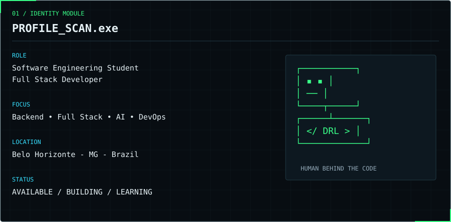
</picture>

Sou **Diogo Reis Lago**, estudante de Engenharia de Software e desenvolvedor Full Stack. Construo aplicações web e exploro a integração entre backend, dados e inteligência artificial, com foco em código organizado, aprendizado contínuo e soluções úteis.

<picture>
  <source media="(max-width: 600px)" srcset="assets/tech-stack-mobile.svg">
  
</picture>

Inspect modules / tecnologias em texto

- **BACKEND:** Node.js • PHP • Python • Go. APIs / lógica / serviços.
- **FRONTEND:** React • TypeScript • HTML • Sass. Interfaces / componentes.
- **DATABASE:** MySQL • MongoDB • Redis. Persistência / consultas / cache.
- **DEVOPS / CLOUD:** Docker • GitHub Actions • AWS. Containers / entrega / estudo.
- **AI / DATA:** Pandas • NumPy • Scikit-learn. ETL / análise / machine learning.
- **TOOLS:** Git • Jupyter • Postman. Versionamento / exploração / APIs.

<picture>
  <source media="(max-width: 600px)" srcset="assets/projects-label-mobile.svg">
  
</picture>

<!-- REPO_BACKEND_URL / REPO_BACKEND_NAME / REPO_BACKEND_DESCRIPTION / REPO_BACKEND_STACK: edit assets/profile.json -->
<a href="https://github.com/LazuliOO2/Back-End">
<picture>
  <source media="(max-width: 600px)" srcset="assets/project-card-backend-mobile.svg">
  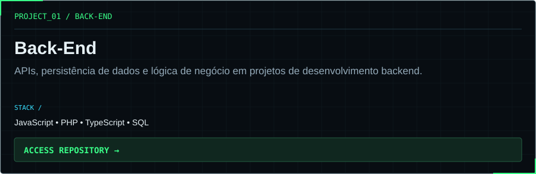
</picture>
</a>

<!-- REPO_FRONTEND_URL / REPO_FRONTEND_NAME / REPO_FRONTEND_DESCRIPTION / REPO_FRONTEND_STACK: edit assets/profile.json -->
<a href="https://github.com/LazuliOO2/Front-End">
<picture>
  <source media="(max-width: 600px)" srcset="assets/project-card-frontend-mobile.svg">
  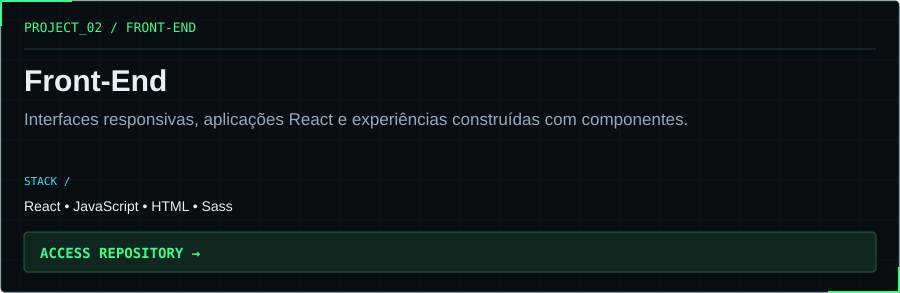
</picture>
</a>

<!-- REPO_FULLSTACK_URL / REPO_FULLSTACK_NAME / REPO_FULLSTACK_DESCRIPTION / REPO_FULLSTACK_STACK: edit assets/profile.json -->
<a href="https://github.com/LazuliOO2/Full-Stack-">
<picture>
  <source media="(max-width: 600px)" srcset="assets/project-card-fullstack-mobile.svg">
  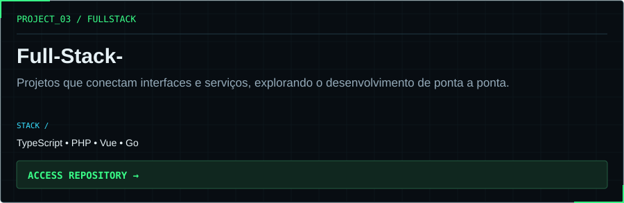
</picture>
</a>

<!-- REPO_WORKBENCH_URL / REPO_WORKBENCH_NAME / REPO_WORKBENCH_DESCRIPTION / REPO_WORKBENCH_STACK: edit assets/profile.json -->
<a href="https://github.com/LazuliOO2/workbench">
<picture>
  <source media="(max-width: 600px)" srcset="assets/project-card-workbench-mobile.svg">
  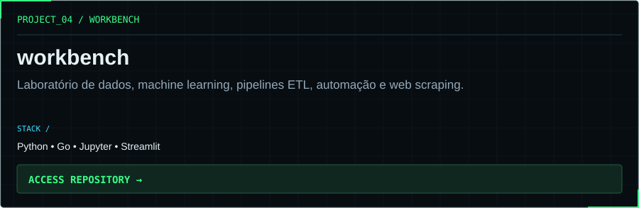
</picture>
</a>

<picture>
  <source media="(max-width: 600px)" srcset="assets/telemetry-mobile.svg">
  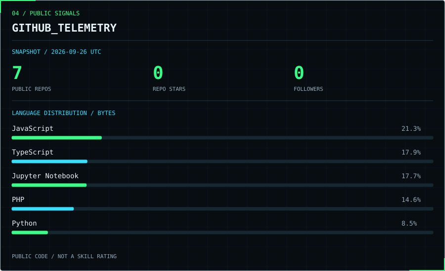
</picture>

<picture>
  <source media="(max-width: 600px)" srcset="assets/activity-mobile.svg">
  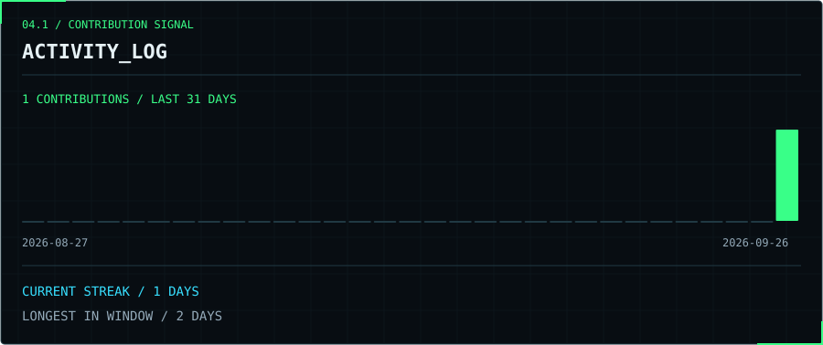
</picture>

Inspect telemetry / origem e escopo

Snapshot: **2026-09-26 UTC**. [Dados utilizados](assets/telemetry.json) · [Contribuições no GitHub](https://github.com/LazuliOO2?tab=overview).

Estatísticas da API pública do GitHub. Linguagens representam bytes dos repositórios públicos próprios, excluindo forks; não medem proficiência. Os cinco maiores valores são exibidos; as porcentagens consideram todas as linguagens, incluindo notebooks. Repositórios públicos incluem forks; estrelas são somadas nesses repositórios.

Atividade e streak usam o calendário público do GitHub. A sequência atual admite o dia de hoje ainda sem contribuições; a maior sequência se limita à janela coletada. Os painéis são snapshots, atualizados pelo comando documentado no [guia de personalização](docs/CUSTOMIZATION.md).

<picture>
  <source media="(max-width: 600px)" srcset="assets/mission-mobile.svg">
  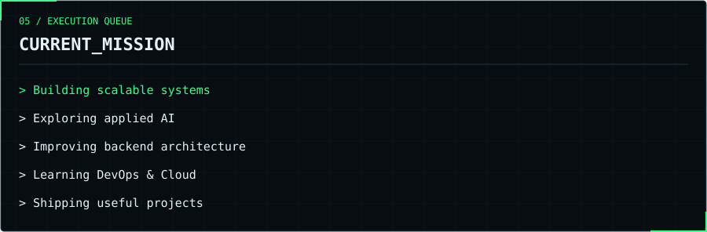
</picture>

<picture>
  <source media="(max-width: 600px)" srcset="assets/contact-label-mobile.svg">
  
</picture>

  <a href="https://github.com/LazuliOO2">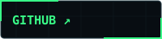</a>
  <a href="https://www.linkedin.com/in/diogo-dos-reis-lago-68a944209">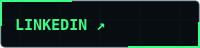</a>
  <a href="mailto:olazulioo2@gmail.com">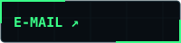</a>
  <a href="https://lazulioo2.github.io/diogoreis/">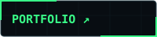</a>

<a href="mailto:olazulioo2@gmail.com">olazulioo2@gmail.com</a>

<picture>
  <source media="(max-width: 600px)" srcset="assets/footer-mobile.svg">
  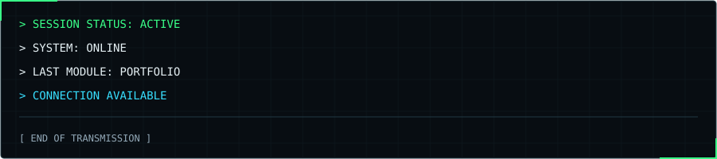
</picture>
